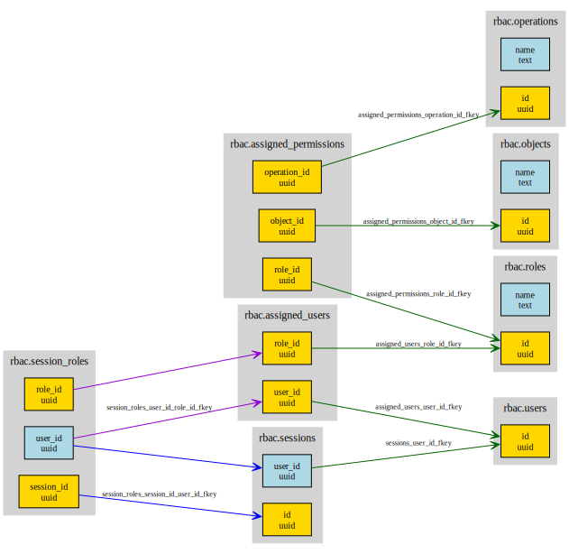

# PostgreSQL RBAC Extension

This extension implements Core Role-Based Access Control (RBAC) as specified in [INCITS 359-2012 (R2022)].

## Installation

```bash
make install
```

Then in PostgreSQL:

```sql
CREATE EXTENSION rbac;
```

## Usage

### Creating Users and Roles

```sql
-- Create users with externally provided UUIDs
SELECT rbac.add_user(user_id => '123e4567-e89b-12d3-a456-426614174000'::UUID);
SELECT rbac.add_user(user_id => '987fcdeb-51a2-43f1-b321-123456789abc'::UUID);

-- Create roles
SELECT rbac.add_role(role_name => 'admin');
SELECT rbac.add_role(role_name => 'user');

-- Assign users to roles
SELECT rbac.assign_user
(
    user_id => '123e4567-e89b-12d3-a456-426614174000'::UUID,
    role_id => (SELECT id FROM rbac.roles WHERE name = 'admin')
);
```

### Managing Permissions

```sql
-- Create operations and objects
SELECT rbac.add_operation(operation_name => 'read');
SELECT rbac.add_operation(operation_name => 'write');
SELECT rbac.add_object(object_name => 'document1');

-- Grant permissions to roles
SELECT rbac.grant_permission
(
    operation_id => (SELECT id FROM rbac.operations WHERE name = 'read'),
    object_id => (SELECT id FROM rbac.objects WHERE name = 'document1'),
    role_id => (SELECT id FROM rbac.roles WHERE name = 'user')
);
```

### Session Management

```sql
-- Create a session with active roles (using user UUID)
SELECT rbac.create_session
(
    user_id => '123e4567-e89b-12d3-a456-426614174000'::UUID,
    active_role_set => ARRAY[(SELECT id FROM rbac.roles WHERE name = 'admin')]::UUID[]
);

-- Check access
SELECT rbac.check_access
(
    session_id => (SELECT id FROM rbac.sessions),
    operation_id => (SELECT id FROM rbac.operations WHERE name = 'read'),
    object_id => (SELECT id FROM rbac.objects WHERE name = 'document1')
);
```

## Functions

This extension provides the following functions organized by category:

### User Management

- `rbac.add_user(user_id UUID) RETURNS BOOLEAN`  
  Adds a new user with the specified UUID

- `rbac.delete_user(user_id UUID) RETURNS BOOLEAN`  
  Deletes a user and all associated assignments and sessions

- `rbac.assign_user(user_id UUID, role_id UUID) RETURNS BOOLEAN`  
  Assigns a user to a role

- `rbac.deassign_user(user_id UUID, role_id UUID) RETURNS BOOLEAN`  
  Removes a user's assignment to a role

### Role Management

- `rbac.add_role(role_name TEXT) RETURNS UUID`  
  Creates a new role and returns its UUID

- `rbac.delete_role(role_id UUID) RETURNS BOOLEAN`  
  Deletes a role and all associated permissions and assignments

### Object and Operation Management

- `rbac.add_object(object_name TEXT) RETURNS UUID`  
  Creates a new object and returns its UUID

- `rbac.add_operation(operation_name TEXT) RETURNS UUID`  
  Creates a new operation and returns its UUID

### Permission Management

- `rbac.grant_permission(operation_id UUID, object_id UUID, role_id UUID) RETURNS BOOLEAN`  
  Grants permission to perform an operation on an object to a role

- `rbac.revoke_permission(operation_id UUID, object_id UUID, role_id UUID) RETURNS BOOLEAN`  
  Revokes permission to perform an operation on an object from a role

### Session Management

- `rbac.create_session(user_id UUID, active_role_set UUID[]) RETURNS UUID`  
  Creates a new session for a user with specified active roles

- `rbac.delete_session(user_id UUID, session_id UUID) RETURNS BOOLEAN`  
  Deletes a session and all associated active roles

- `rbac.add_active_role(user_id UUID, session_id UUID, role_id UUID) RETURNS BOOLEAN`  
  Adds an active role to an existing session

- `rbac.drop_active_role(user_id UUID, session_id UUID, role_id UUID) RETURNS BOOLEAN`  
  Removes an active role from a session

### Access Control

- `rbac.check_access(session_id UUID, operation_id UUID, object_id UUID) RETURNS BOOLEAN`  
  Checks if a session has permission to perform an operation on an object

### Query Functions

- `rbac.assigned_roles(user_id UUID) RETURNS TABLE(role_id UUID, role_name TEXT)`  
  Returns all roles assigned to a user

- `rbac.assigned_users(role_id UUID) RETURNS TABLE(user_id UUID)`  
  Returns all users assigned to a role

- `rbac.role_permissions(role_id UUID) RETURNS TABLE(operation_id UUID, operation_name TEXT, object_id UUID, object_name TEXT)`  
  Returns all permissions granted to a role

- `rbac.role_operations_on_object(role_id UUID, object_id UUID) RETURNS TABLE(operation_id UUID, operation_name TEXT)`  
  Returns all operations a role can perform on a specific object

- `rbac.session_permissions(session_id UUID) RETURNS TABLE(operation_id UUID, operation_name TEXT, object_id UUID, object_name TEXT)`  
  Returns all permissions available to a session through its active roles

- `rbac.session_roles(session_id UUID) RETURNS TABLE(role_id UUID, role_name TEXT)`  
  Returns all active roles in a session

- `rbac.user_permissions(user_id UUID) RETURNS TABLE(operation_id UUID, operation_name TEXT, object_id UUID, object_name TEXT)`  
  Returns all permissions available to a user through their assigned roles

- `rbac.user_operations_on_object(user_id UUID, object_id UUID) RETURNS TABLE(operation_id UUID, operation_name TEXT)`  
  Returns all operations a user can perform on a specific object through their assigned roles

## Schema



### Legend

- **Gold boxes**: Primary Key columns
- **Light blue boxes**: Regular columns
- **Green edges**: Single column foreign keys
- **Colored edges**: Composite foreign keys (edges with the same color belong to the same constraint)

## Design Decisions

- Uses UUID for all identifiers instead of NAME types
- User IDs are provided externally (not generated by RBAC system)
- No user information stored in RBAC tables (only UUID references)
- Pure standard SQL-body implementation with BEGIN ATOMIC syntax
- All objects in 'rbac' schema
- Direct permission model using (operation_id, object_id, role_id) triplets
- Session creation accepts UUID[] array for active roles
- Empty active role sets are permitted

## Standard Compliance Note

The [INCITS 359-2012 (R2022)] standard does not specify how objects and operations are created or managed - it assumes they already exist within the system. This implementation includes `add_object()` and `add_operation()` functions as practical extensions beyond the standard to enable complete system functionality via the functional interface, without needing direct table access.

## License

This extension is licensed under The PostgreSQL License. See the [LICENSE](LICENSE) file for details.

[INCITS 359-2012 (R2022)]: https://webstore.ansi.org/standards/incits/incits3592012r2022
